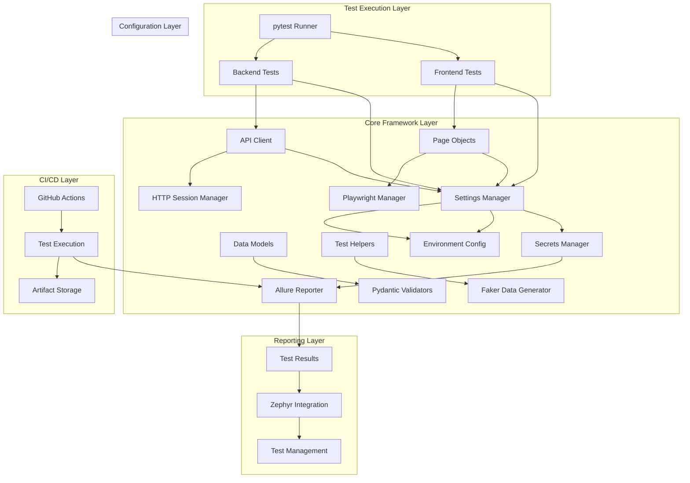
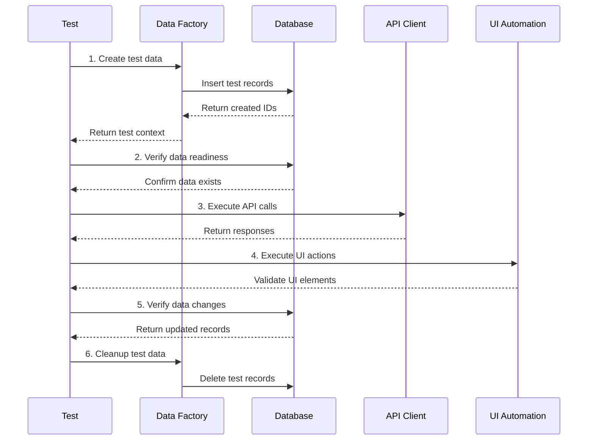
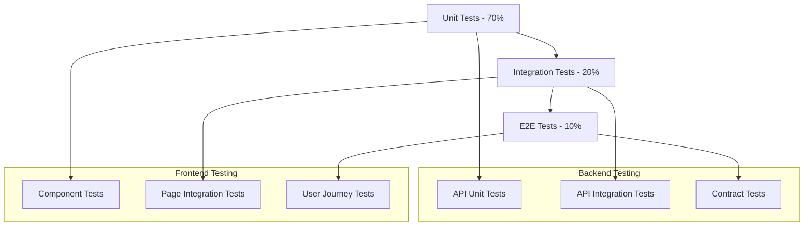
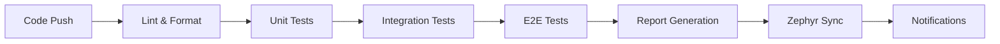

# Design Document

## Overview

O framework de automação de testes Python será construído como uma solução modular e escalável que suporta testes de backend (API) e frontend (UI). A arquitetura segue princípios de clean code, reutilização e manutenibilidade, com integração nativa ao ecossistema Python de testes (pytest) e ferramentas modernas como Playwright para automação de UI.

## Architecture

### High-Level Architecture



### Directory Structure

```
qa-automation/
├── .github/workflows/          # CI/CD pipelines
├── .kiro/                      # Kiro configuration
├── core/                       # Framework core components
│   ├── api/                    # API client and endpoints
│   ├── config/                 # Configuration management
│   ├── database/               # Database integration
│   │   ├── manager.py          # Database connection manager
│   │   ├── factory.py          # Test data factory
│   │   ├── models.py           # SQLAlchemy models
│   │   └── fixtures.py         # Database fixtures
│   ├── helpers/                # Utility functions
│   ├── models/                 # Pydantic data models
│   └── ui/                     # UI automation components
├── tests/                      # Test suites
│   ├── backend/                # API tests
│   ├── frontend/               # UI tests
│   ├── integration/            # End-to-end tests with DB
│   └── conftest.py             # Global fixtures
├── fixtures/                   # Test data and fixtures
│   ├── sql/                    # SQL scripts for test data
│   └── json/                   # JSON test data files
├── scripts/                    # Utility scripts
│   ├── db_setup.py             # Database setup script
│   └── db_cleanup.py           # Database cleanup script
├── reports/                    # Generated reports
└── docs/                       # Documentation
```

## Components and Interfaces

### 1. Configuration Management

**Settings Manager (`core/config/settings.py`)**
- Centraliza todas as configurações usando Pydantic Settings
- Suporta múltiplos ambientes (dev, staging, prod)
- Carrega variáveis de ambiente com validação
- Implementa padrão Singleton para performance

```python
class Settings(BaseSettings):
    # Environment
    env: Literal["dev", "staging", "prod"] = "dev"
    
    # API Configuration
    api_base_url: str
    api_timeout: int = 30
    api_retries: int = 3
    
    # Authentication
    auth_user: str
    auth_password: str
    
    # Frontend Configuration
    frontend_base_url: str
    browser: Literal["chromium", "firefox", "webkit"] = "chromium"
    headless: bool = True
    
    # Database Configuration
    db_host: str
    db_port: int = 5432
    db_name: str
    db_user: str
    db_password: str
    db_pool_size: int = 10
    db_max_overflow: int = 20
    
    # Integrations
    zephyr_api_token: str = ""
    jira_api_token: str = ""
    
    @property
    def database_url(self) -> str:
        return f"postgresql://{self.db_user}:{self.db_password}@{self.db_host}:{self.db_port}/{self.db_name}"
```

**Environment Manager (`core/config/environments.py`)**
- Define configurações específicas por ambiente
- Permite override de configurações base
- Facilita deployment em diferentes ambientes

### 2. API Testing Framework

**HTTP Client (`core/api/client.py`)**
- Wrapper sobre requests com funcionalidades avançadas
- Retry automático com backoff exponencial
- Gerenciamento automático de autenticação
- Logging detalhado de requests/responses
- Session pooling para performance

```python
class APIClient:
    def __init__(self):
        self.session = self._create_session_with_retry()
        self._token: Optional[str] = None
    
    def authenticate(self, username: str, password: str) -> str
    def get(self, endpoint: str, **kwargs) -> requests.Response
    def post(self, endpoint: str, **kwargs) -> requests.Response
    def put(self, endpoint: str, **kwargs) -> requests.Response
    def delete(self, endpoint: str, **kwargs) -> requests.Response
```

**Endpoint Definitions (`core/api/endpoints.py`)**
- Centraliza definições de endpoints
- Facilita manutenção e versionamento
- Suporta path parameters e query strings

### 3. Data Models and Validation

**Pydantic Models (`core/models/`)**
- Modelos para request/response validation
- Type safety em tempo de execução
- Serialização/deserialização automática
- Validação de business rules

```python
class UserCreate(BaseModel):
    username: str = Field(..., min_length=3, max_length=50)
    email: EmailStr
    password: str = Field(..., min_length=8)

class UserResponse(BaseModel):
    id: int
    username: str
    email: EmailStr
    is_active: bool = True
    created_at: datetime
```

### 4. Database Integration Framework

**SQLAlchemy ORM Integration**
SQLAlchemy é o ORM escolhido por ser o equivalente ao Entity Framework no ecossistema Python:
- **Maturidade**: 15+ anos de desenvolvimento, amplamente testado
- **Performance**: Lazy loading, connection pooling, query optimization
- **Flexibilidade**: Suporta raw SQL e ORM patterns
- **Compatibilidade**: PostgreSQL, MySQL, SQL Server, SQLite, Oracle
- **Ecosystem**: Integração nativa com pytest, Alembic para migrations

**Database Manager (`core/database/manager.py`)**
- Conexões múltiplas para diferentes ambientes
- Pool de conexões para performance otimizada
- Transações isoladas por teste com rollback automático
- Suporte completo a relacionamentos e foreign keys

```python
from sqlalchemy import create_engine, text
from sqlalchemy.orm import sessionmaker, Session
from contextlib import contextmanager

class DatabaseManager:
    def __init__(self, connection_string: str):
        self.engine = create_engine(
            connection_string, 
            pool_size=10,
            max_overflow=20,
            pool_pre_ping=True  # Verifica conexões antes de usar
        )
        self.session_factory = sessionmaker(bind=self.engine)
    
    @contextmanager
    def get_session(self) -> Session:
        """Context manager para sessões com rollback automático."""
        session = self.session_factory()
        try:
            yield session
            session.commit()
        except Exception:
            session.rollback()
            raise
        finally:
            session.close()
    
    def create_test_data(self, model_class, data: Dict) -> Any
    def query_data(self, query: str, params: Dict = None) -> List[Dict]
    def execute_raw_sql(self, sql: str, params: Dict = None) -> Any
    def verify_data_exists(self, model_class, **filters) -> bool
    def cleanup_by_test_id(self, test_id: str) -> None
```

**SQLAlchemy Models (`core/database/models.py`)**
- Definição de entidades usando SQLAlchemy ORM
- Relacionamentos declarativos (ForeignKey, relationship)
- Validações a nível de modelo
- Métodos de conveniência para testes

```python
from sqlalchemy import Column, Integer, String, DateTime, ForeignKey, Boolean
from sqlalchemy.ext.declarative import declarative_base
from sqlalchemy.orm import relationship

Base = declarative_base()

class User(Base):
    __tablename__ = 'users'
    
    id = Column(Integer, primary_key=True)
    username = Column(String(50), unique=True, nullable=False)
    email = Column(String(100), unique=True, nullable=False)
    is_active = Column(Boolean, default=True)
    created_at = Column(DateTime, default=datetime.utcnow)
    
    # Relacionamentos
    profile = relationship("UserProfile", back_populates="user", uselist=False)
    orders = relationship("Order", back_populates="user")

class UserProfile(Base):
    __tablename__ = 'user_profiles'
    
    id = Column(Integer, primary_key=True)
    user_id = Column(Integer, ForeignKey('users.id'), nullable=False)
    full_name = Column(String(100))
    phone = Column(String(20))
    
    # Relacionamento
    user = relationship("User", back_populates="profile")
```

**Test Data Factory (`core/database/factory.py`)**
- Factory pattern usando SQLAlchemy models
- Builder pattern para dados complexos
- Relacionamentos automáticos entre entidades
- Tracking de dados criados para cleanup

```python
from faker import Faker
from typing import Dict, List, Any
import uuid

class TestDataFactory:
    def __init__(self, db_manager: DatabaseManager):
        self.db_manager = db_manager
        self.faker = Faker('pt_BR')
        self.created_entities: Dict[str, List[Any]] = {}
    
    def create_user_with_profile(self, test_id: str, **overrides) -> UserTestData:
        """Cria usuário completo com perfil."""
        with self.db_manager.get_session() as session:
            # Criar usuário
            user_data = {
                'username': self.faker.user_name(),
                'email': self.faker.email(),
                'is_active': True,
                **overrides
            }
            user = User(**user_data)
            session.add(user)
            session.flush()  # Para obter o ID
            
            # Criar perfil
            profile = UserProfile(
                user_id=user.id,
                full_name=self.faker.name(),
                phone=self.faker.phone_number()
            )
            session.add(profile)
            session.commit()
            
            # Registrar para cleanup
            self._register_for_cleanup(test_id, 'User', user.id)
            self._register_for_cleanup(test_id, 'UserProfile', profile.id)
            
            return UserTestData(user=user, profile=profile)
    
    def create_complete_order_scenario(self, test_id: str, user_id: int = None) -> OrderTestData:
        """Cria cenário completo de pedido com usuário, itens e pagamento."""
        # Implementação similar...
        pass
    
    def cleanup_test_data(self, test_id: str) -> None:
        """Remove todos os dados criados para um teste específico."""
        if test_id not in self.created_entities:
            return
            
        with self.db_manager.get_session() as session:
            # Cleanup em ordem reversa (relacionamentos)
            for entity_type, entity_ids in reversed(self.created_entities[test_id]):
                model_class = globals()[entity_type]  # User, UserProfile, etc.
                session.query(model_class).filter(
                    model_class.id.in_(entity_ids)
                ).delete(synchronize_session=False)
            
            session.commit()
            del self.created_entities[test_id]
```

### 5. Test Helpers and Utilities

**Validators (`core/helpers/validators.py`)**
- Validação de status codes
- Validação de tempo de resposta
- Validação de schemas JSON
- Validação de campos obrigatórios
- Validação de dados no banco

**Data Generator (`core/helpers/data_generator.py`)**
- Geração de dados de teste usando Faker
- Dados localizados para Brasil (CPF, telefone)
- Senhas seguras com critérios específicos
- Dados consistentes para testes
- Integração com factory de dados

### 6. Frontend Testing Framework

**Base Page Object (`tests/frontend/pages/base_page.py`)**
- Classe base com funcionalidades comuns
- Wrapper sobre Playwright com logging
- Métodos padronizados para interação
- Screenshot automático em falhas

```python
class BasePage:
    def __init__(self, page: Page):
        self.page = page
        self.timeout = 30000
    
    def click(self, selector: str)
    def fill(self, selector: str, value: str)
    def wait_for_selector(self, selector: str)
    def take_screenshot(self, name: str)
```

**Specific Page Objects**
- Encapsulam lógica específica de cada página
- Locators centralizados e maintíveis
- Métodos de alto nível para ações de usuário
- Validações específicas da página

### 7. Test Organization

**Fixtures (`tests/conftest.py`)**
- Fixtures globais para setup/teardown
- Cliente API autenticado
- Configurações de browser
- Dados de teste reutilizáveis
- Database fixtures com transações isoladas
- Test data factory fixtures

**Markers**
- `@pytest.mark.smoke` - Testes críticos
- `@pytest.mark.regression` - Suite completa
- `@pytest.mark.backend` - Testes de API
- `@pytest.mark.frontend` - Testes de UI
- `@pytest.mark.slow` - Testes demorados

## Data Models

### Test Data Models

```python
# User Management
UserCreate -> UserResponse
UserUpdate -> UserResponse
UserList -> List[UserResponse]

# Authentication
LoginRequest -> TokenResponse
RefreshRequest -> TokenResponse

# Test Execution
TestResult -> AllureResult
TestExecution -> ZephyrExecution

# Database Test Data
TestDataContext {
    test_id: str
    created_entities: List[EntityReference]
    cleanup_required: bool
}

UserTestData {
    user: User
    profile: UserProfile
    permissions: List[Permission]
    cleanup_sql: List[str]
}

OrderTestData {
    order: Order
    items: List[OrderItem]
    payment: Payment
    related_users: List[User]
}
```

### Configuration Models

```python
# Environment Configuration
Environment {
    name: str
    api_url: str
    frontend_url: str
    db_config: DatabaseConfig
}

# Test Configuration
TestConfig {
    parallel_workers: int
    timeout: int
    retry_count: int
    screenshot_on_failure: bool
}
```

## Error Handling

### API Error Handling

1. **HTTP Errors**
   - Retry automático para 5xx errors
   - Logging detalhado de falhas
   - Timeout handling com mensagens claras
   - Rate limiting detection

2. **Authentication Errors**
   - Token refresh automático
   - Fallback para re-authentication
   - Credential validation

3. **Validation Errors**
   - Pydantic validation com mensagens claras
   - Schema mismatch detection
   - Type conversion errors

### UI Error Handling

1. **Element Not Found**
   - Retry com waits explícitos
   - Multiple locator strategies
   - Fallback selectors

2. **Timing Issues**
   - Network idle waits
   - Element state waits
   - Custom wait conditions

3. **Browser Crashes**
   - Automatic browser restart
   - Test isolation
   - Screenshot capture before crash

### Test Execution Errors

1. **Setup/Teardown Failures**
   - Graceful degradation
   - Partial cleanup
   - Error reporting

2. **Data Dependencies**
   - Fallback test data
   - Dynamic data generation
   - Dependency validation

## Database Technology Choice

### Por que SQLAlchemy?

SQLAlchemy é o equivalente ao Entity Framework no ecossistema Python e foi escolhido pelos seguintes motivos:

**Comparação com Entity Framework (C#):**
| Recurso | Entity Framework | SQLAlchemy |
|---------|------------------|------------|
| Code First | ✅ | ✅ |
| Database First | ✅ | ✅ |
| Lazy Loading | ✅ | ✅ |
| Change Tracking | ✅ | ✅ |
| Migrations | ✅ (EF Migrations) | ✅ (Alembic) |
| LINQ/Query API | ✅ | ✅ (Query API) |
| Raw SQL | ✅ | ✅ |
| Connection Pooling | ✅ | ✅ |
| Transaction Support | ✅ | ✅ |

**Vantagens Específicas para Testes:**
1. **Session Management**: Controle fino sobre transações e rollbacks
2. **Test Isolation**: Cada teste pode ter sua própria sessão isolada
3. **Performance**: Connection pooling otimizado para execução paralela
4. **Flexibility**: Suporte tanto para ORM quanto raw SQL quando necessário
5. **Ecosystem**: Integração nativa com pytest através de fixtures

**Alternativas Consideradas:**
- **Django ORM**: Muito acoplado ao Django framework
- **Peewee**: Mais simples, mas menos recursos para casos complexos
- **Tortoise ORM**: Async-first, mas menos maduro
- **Raw SQL**: Mais controle, mas muito mais código boilerplate

## Database Testing Strategy

### End-to-End Test Flow with Database

O framework suporta o fluxo completo de teste com integração de banco de dados:



### Database Test Pattern

```python
@pytest.fixture
def test_data_context(db_manager, test_data_factory):
    """Fixture que gerencia ciclo completo de dados de teste."""
    context = TestDataContext(test_id=generate_test_id())
    yield context
    # Cleanup automático
    test_data_factory.cleanup_test_data(context.test_id)

def test_complete_user_workflow(api_client, ui_page, test_data_context, db_manager, test_data_factory):
    """Exemplo de teste end-to-end com banco de dados usando SQLAlchemy."""
    
    # 1. Criar massa de dados usando Factory
    user_data = test_data_factory.create_user_with_profile(
        test_id=test_data_context.test_id,
        email="test@example.com",
        is_active=True
    )
    
    # 2. Verificar dados estão prontos usando SQLAlchemy
    with db_manager.get_session() as session:
        user_exists = session.query(User).filter(User.id == user_data.user.id).first()
        profile_exists = session.query(UserProfile).filter(
            UserProfile.user_id == user_data.user.id
        ).first()
        
        assert user_exists is not None
        assert profile_exists is not None
        assert user_exists.is_active is True
    
    # 3. Executar ações via API
    response = api_client.post(f"/users/{user_data.user.id}/activate")
    assert response.status_code == 200
    
    # 4. Executar ações via UI
    ui_page.navigate_to_user_profile(user_data.user.id)
    ui_page.update_profile_info({"phone": "+5511999999999"})
    ui_page.save_changes()
    
    # 5. Validar mudanças no banco usando ORM e Raw SQL
    with db_manager.get_session() as session:
        # Usando ORM
        updated_user = session.query(User).filter(User.id == user_data.user.id).first()
        assert updated_user.is_active is True
        
        # Usando Raw SQL quando necessário para validações específicas
        result = session.execute(
            text("SELECT phone FROM user_profiles WHERE user_id = :user_id"),
            {"user_id": user_data.user.id}
        ).fetchone()
        assert result.phone == "+5511999999999"
        
        # Validar relacionamentos
        assert updated_user.profile.phone == "+5511999999999"
    
    # 6. Cleanup é automático via fixture test_data_context
```

## Testing Strategy

### Test Pyramid Implementation



### Test Categories

1. **Smoke Tests (5-10 tests, ~2 minutes)**
   - Critical path validation
   - Basic functionality check
   - Authentication flow
   - Key API endpoints

2. **Regression Tests (50-100 tests, ~15 minutes)**
   - Full feature coverage
   - Edge cases
   - Error scenarios
   - Cross-browser testing

3. **Integration Tests (20-30 tests, ~10 minutes)**
   - End-to-end workflows
   - System interactions
   - Data flow validation

### Parallel Execution Strategy

1. **Backend Tests**
   - Parallel execution por classe
   - Isolated test data
   - Shared authentication

2. **Frontend Tests**
   - Parallel execution por browser
   - Isolated browser contexts
   - Shared page objects

3. **Resource Management**
   - Connection pooling
   - Browser instance reuse
   - Memory optimization

## CI/CD Integration

### Pipeline Architecture



### Execution Matrix

| Trigger | Tests | Environment | Browsers | Parallel |
|---------|-------|-------------|----------|----------|
| PR | Smoke | Dev | Chromium | 2x |
| Push to main | Regression | Staging | Chrome, Firefox | 4x |
| Nightly | Full Suite | Staging | All browsers | 8x |
| Release | Full Suite | Prod-like | All browsers | 4x |

### Artifact Management

1. **Test Reports**
   - HTML reports (pytest-html)
   - Allure reports with history
   - JUnit XML for CI integration

2. **Screenshots/Videos**
   - Failure screenshots
   - Test execution videos
   - Browser console logs

3. **Performance Metrics**
   - Test execution times
   - API response times
   - Browser performance metrics

## Reporting and Analytics

### Allure Integration

1. **Rich Reporting**
   - Step-by-step execution
   - Request/response attachments
   - Screenshots and videos
   - Historical trends

2. **Categorization**
   - Epic/Feature/Story organization
   - Severity levels
   - Test types and markers

3. **Traceability**
   - Jira ticket links
   - Test case mapping
   - Requirement coverage

### Zephyr Scale Integration

1. **Automated Sync**
   - Test execution results
   - Test cycle creation
   - Status mapping (Pass/Fail/Blocked)

2. **Bi-directional Sync**
   - Test case updates from Zephyr
   - Execution history
   - Defect linking

### Metrics Dashboard

1. **Quality Metrics**
   - Pass/fail rates
   - Flakiness detection
   - Coverage metrics

2. **Performance Metrics**
   - Execution time trends
   - Resource utilization
   - Bottleneck identification

3. **Team Metrics**
   - Test automation ROI
   - Defect detection rate
   - Maintenance overhead

## Security Considerations

### Credential Management

1. **Environment Variables**
   - No hardcoded credentials
   - GitHub Secrets for CI/CD
   - Local .env files for development

2. **Token Management**
   - Automatic token refresh
   - Secure token storage
   - Token expiration handling

### Test Data Security

1. **Synthetic Data**
   - Faker-generated test data
   - No production data in tests
   - PII anonymization

2. **Data Cleanup**
   - Automatic test data cleanup
   - Isolated test environments
   - Data retention policies

## Performance Optimization

### Execution Performance

1. **Parallel Execution**
   - pytest-xdist for backend tests
   - Multiple browser instances for UI tests
   - Optimal worker count based on resources

2. **Resource Optimization**
   - Connection pooling
   - Browser context reuse
   - Memory management

### Maintenance Performance

1. **Code Organization**
   - Modular architecture
   - Reusable components
   - Clear separation of concerns

2. **Test Maintenance**
   - Page Object pattern
   - Centralized locators
   - Data-driven tests

## Scalability Design

### Horizontal Scaling

1. **Test Distribution**
   - Multiple CI runners
   - Cloud-based execution
   - Dynamic resource allocation

2. **Data Scaling**
   - Multiple test environments
   - Database per test worker
   - Isolated test data

### Vertical Scaling

1. **Framework Extension**
   - Plugin architecture
   - Custom markers
   - Configurable components

2. **Integration Points**
   - Multiple reporting tools
   - Various CI/CD platforms
   - Different test management tools